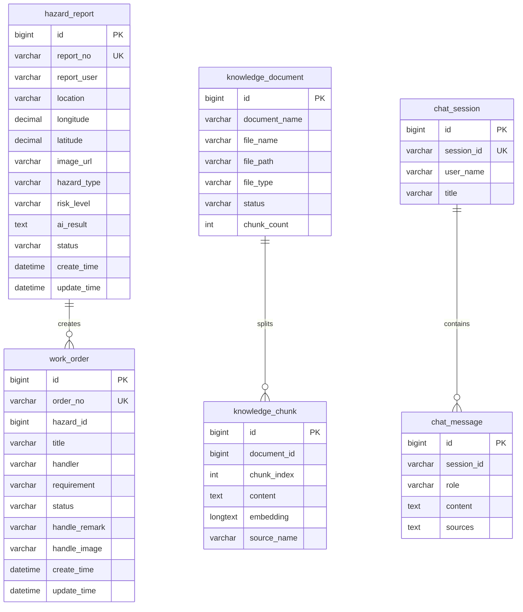

# 数据库设计

## ER图

## 核心表说明

| 表名 | 用途 | 关键字段 |
| --- | --- | --- |
| `hazard_report` | 隐患上报与审核 | `report_no`、`hazard_type`、`risk_level`、`status`、`longitude`、`latitude` |
| `work_order` | 隐患处置工单闭环 | `order_no`、`hazard_id`、`handler`、`status`、`handle_image` |
| `knowledge_document` | RAG知识文档元数据 | `document_name`、`file_path`、`status`、`chunk_count` |
| `knowledge_chunk` | 知识切片与Embedding | `document_id`、`content`、`embedding`、`source_name` |
| `chat_session` | 多轮问答会话 | `session_id`、`user_name`、`title` |
| `chat_message` | 问答消息记录 | `session_id`、`role`、`content`、`sources` |

## 状态约定

隐患状态：`待审核 -> 已审核 -> 处理中 -> 待复核 -> 已完成`。

工单状态：`待处理 -> 处理中 -> 待复核 -> 已完成`。

退回处置可使用：`待复核 -> 处理中`。当前交付版本以前向闭环为主。

## SQL脚本

- 完整建表：`docs/sql/schema.sql`
- 课程演示数据：`docs/sql/demo_data.sql`
- 后端维护脚本：`backend/sql/`
