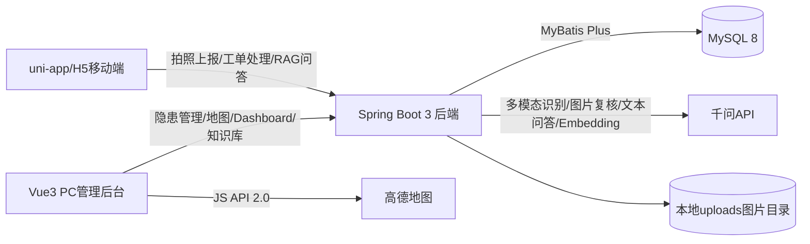
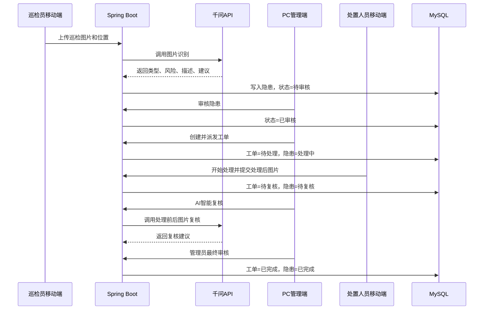
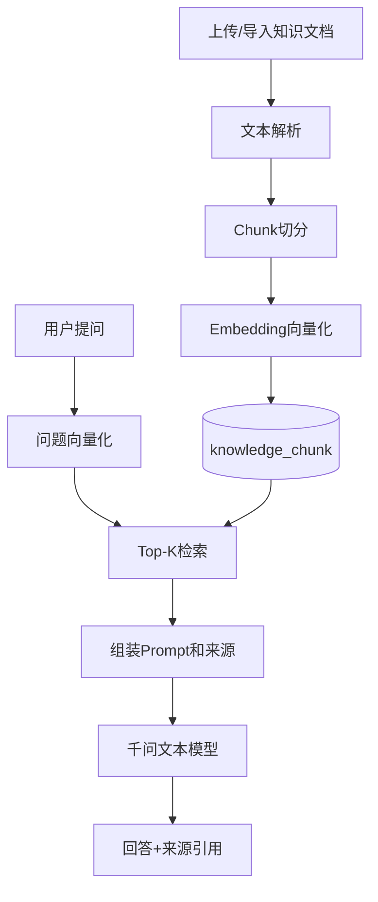

# 系统架构

## 总体架构

## 模块说明

- 移动端：面向巡检员和处置人员，提供拍照上报、AI识别确认、我的上报、我的工单、处理结果提交和AI助手。
- PC管理端：面向管理员，提供隐患审核、工单派发、复核完成、航道隐患一张图、Dashboard、知识库管理和RAG问答。
- 后端：统一承载业务接口、文件上传、AI调用、RAG检索、状态流转和数据库访问。
- MySQL：存储隐患、工单、知识库文档、知识切片、问答会话和问答消息。
- 千问API：提供图片隐患识别、处置前后图片复核、文本问答和Embedding能力。
- 高德地图：在PC管理端展示隐患点位和风险等级。

## 核心业务闭环

## RAG架构

